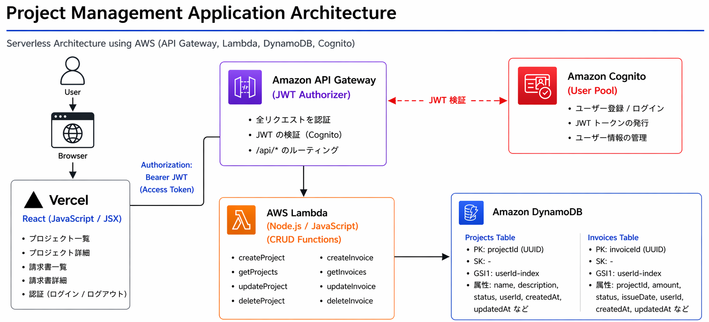
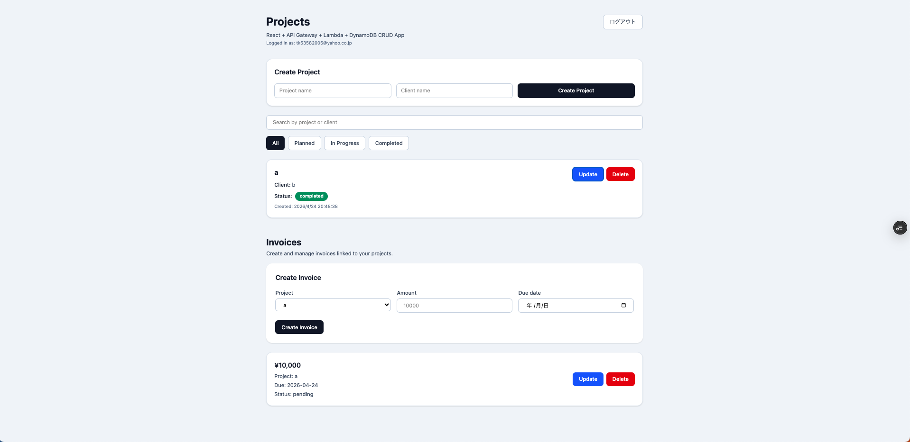

# Project Management App

## Overview
シンプルなプロジェクト管理アプリです。  
React + AWS (API Gateway / Lambda / DynamoDB / Cognito) を用いて、フロントエンドとサーバーレスバックエンドを統合しています。

---

## Architecture



---

## Tech Stack

- React (Vite / JavaScript / JSX)
- Tailwind CSS
- AWS API Gateway
- AWS Lambda (Node.js)
- Amazon DynamoDB
- Amazon Cognito (JWT認証)

---

## Features

### Project Management
- プロジェクト作成
- プロジェクト一覧表示
- ステータス更新（planned / in-progress / completed）
- プロジェクト削除
- ステータスフィルター
- 検索機能（プロジェクト名 / クライアント名）

### Invoice Management
- 請求書作成 / 更新 / 削除
- プロジェクトとの紐付け

### Authentication
- Cognitoによるユーザー認証
- JWTを用いたAPI認可
- ユーザーごとのデータ分離

---

## UI / UX Improvements

以下のような実務を意識したUX改善を実装しています。

- フォームバリデーション（touched state）
- 入力後のみエラーメッセージ表示
- 必須項目の明示（is required）
- 送信ボタンの状態制御（disabled）
- 送信中のローディング表示（Creating...）
- 二重送信防止

---

## UI

- Tailwind CSS を使用
- カードUI
- ステータスに応じたカラー表示

---

## Screenshot



---

## How to Run

```bash
npm install
npm run dev
```

---

## API

```
# Projects
GET    /projects
POST   /projects
PUT    /projects/{projectId}
DELETE /projects/{projectId}

# Invoices
GET    /invoices
POST   /invoices
PUT    /invoices/{invoiceId}
DELETE /invoices/{invoiceId}
```